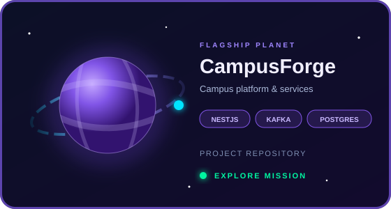
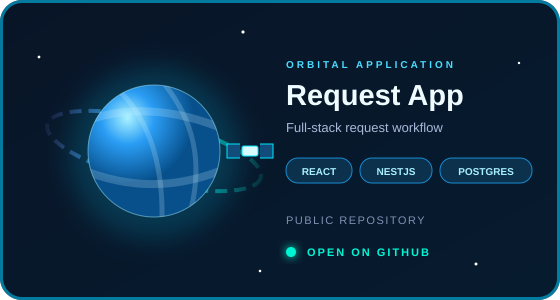
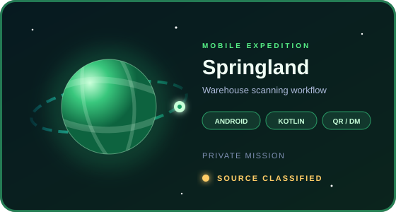
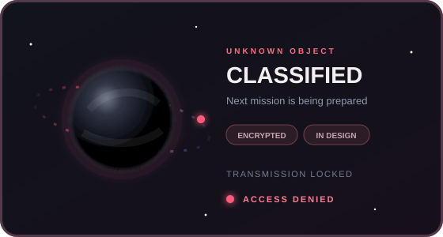

<!--
  Cosmic GitHub profile for @YYEnioneYY
  Replace the Portfolio link before publishing.
-->

  

  

   

  
  

<h2 align="center">🛰️ About Me</h2>

<strong>Full Stack Developer</strong> focused on modern, scalable and clean web applications.I build powerful APIs, responsive interfaces, optimized databases and cloud-ready backend systems.

 

💻 Building production-ready applications with React, NestJS, TypeScript and PostgreSQL

⚙️ Designing REST APIs, authentication systems, databases and event-driven services

🎨 Creating responsive interfaces with React, Vite and Tailwind CSS

🧠 Exploring Artificial Intelligence, Machine Learning, Python and PyTorch

🏗️ Interested in scalable architecture, clean code and distributed systems

🚀 Working toward becoming a strong engineer who builds products people actually use

<h2 align="center">🪐 Technology Orbits</h2>

 

<table align="center">
  <tr>
    <td align="center" width="50%" valign="top">
      <h3>🌐 Frontend Orbit</h3>
      
       
      
        React · Vite · TypeScript · JavaScript 
        HTML5 · CSS3 · Tailwind CSS 
        Responsive Design · Component Architecture 
        State Management · API Integration · SPA
      
    </td>
    <td align="center" width="50%" valign="top">
      <h3>⚙️ Backend Orbit</h3>
      
       
      
        Node.js · NestJS · Express.js 
        PostgreSQL · SQL · Prisma ORM · Kafka 
        REST API · Swagger / OpenAPI · JWT · RBAC 
        Validation · Logging · Security · Clean Architecture
      
    </td>
  </tr>
  <tr>
    <td align="center" width="50%" valign="top">
      <h3>🧠 AI &amp; Machine Learning Orbit</h3>
      
       
      
        Python · PyTorch · Machine Learning Basics 
        Neural Networks · Data Processing 
        Model Training · AI Experiments · Automation
      
    </td>
    <td align="center" width="50%" valign="top">
      <h3>🛠️ Development Tools Orbit</h3>
      
       
        
      
        Git · GitHub · GitHub Actions · Docker · Linux 
        VS Code · Postman · Figma · NPM · PNPM 
        CI/CD · Agile · Code Review · Debugging
      
    </td>
  </tr>
</table>

<h2 align="center">🛸 Mission Control</h2>

  

<h2 align="center">🌌 Project Galaxy</h2>

 

<table align="center">
  <tr>
    <td width="50%" valign="top">
        
    </td>
    <td width="50%" valign="top">
        
    </td>
  </tr>
  <tr>
    <td width="50%" valign="top">
      <a href="https://github.com/YYEnioneYY/UrbanEye" title="UrbanEye">
      
    </td>
    <td width="50%" valign="top">
      <a href="https://github.com/YYEnioneYY/ShadowArenaFront" title="ShadowArenaFront">
      
    </td>
  </tr>
</table>

🟢 Public mission  ·  🟡 Private mission  ·  🔴 Classified object

 

<h2 align="center">📊 GitHub Telemetry</h2>

   

<h2 align="center">🏆 Achievements</h2>

<h2 align="center">📈 Activity Orbit</h2>

<h2 align="center">👾 Contribution Galaxy</h2>

  

  <picture>
    <source
      media="(prefers-color-scheme: dark)"
      srcset="https://raw.githubusercontent.com/YYEnioneYY/YYEnioneYY/output/galaga-contribution-graph-dark.svg"
    />
    <source
      media="(prefers-color-scheme: light)"
      srcset="https://raw.githubusercontent.com/YYEnioneYY/YYEnioneYY/output/galaga-contribution-graph.svg"
    />
    
  </picture>

<h2 align="center">🌍 Connect With Me</h2>

  
  
  

 

  <strong>Open to interesting projects, collaborations and new opportunities.</strong>

 

